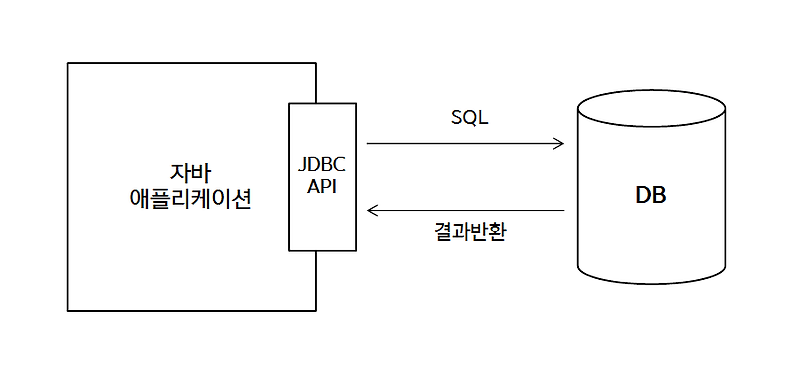

# 01 JPA 소개
## 1.1 SQL을 직접 다룰 때 발생하는 문제점

- 자바로 작성한 애플리케이션은 JDBC API를 사용해거 SQL을 데이터 베이스에 전달 해야람.

1. 비슷한 SQL 구문을 반복적으로 작성해야함.
2. SQL에 의존적인 개발을 피하기 어려워 엔티티 신뢰 불가.
3. 진정한 의미의 계층 분할이 어려움.

### 1.1.3 JPA와 문제해결
- JPA를 사용하면, 객체를 데이터베이스를 저장하고 관리할때, 직접 SQL을 작성하는게 아니라, JPA 가 사용하면 API를 사용

#### 저장기능
`jpa.persisit(member); //저장`
- persist() 메서드는 객체를 데이터베이스에 저장.
- 이 메서드를 호출하면 JPA객체와 매핑정보를 보고 적절한 INSERT SQL을 생성해 데이터베이스에 전달.

#### 조회 기능
```java
String memeberId="helloId";
Member member=jpa.find(Member.class,memeberId); // 조회
```
- find() 메서드는 객체 하나를 데이터베이스에서 조회
- JPA 객체와 매핑정보를 보고 적절한 SELECT SQL 생성해서 DB에 전달하고, 그 결과를 Member 객체를 생성해서 반환.

#### 수정 기능

```java
Member member=jpa.find(Member.class,memberId);
member.setName("이름변경"); //수정
```
- 별도의 수정 메서드를 제공하지 않고 객체의 값을 조회해서 값을 변경만하면 트랜잭션을 커밋할때 적절한 UPDATE SQL이 전달된.

#### 연관된 객체 조회
```java
Member member=jpa.find(Member.class,memberId);
Team team=member.getTeam(); //연관된 객체 조회
```

- 연관된 객체를 사용하는 시점에서 적절한 SELECT SQL 실행
- 따라서 연관된 객체를 마음껏 조회 가능.

## 1.2 패러다임의 불일치
- 패러다임 이란?
  - 어떤 한 시대 사람들의 견해나 사고를 근본적으로 규정하고 있는 테두리로서의 인식의 체계. 또는 사물에 대한 이론적인 틀이나 체계.
- 객체와 관계형 데이터 베이스가 지향하는 목적이 달라, 둘의 기능과 표현방법이 다름 즉, 패러다임의 불일치가 발생함.
- 아래는 패러다임의 불일치로 발생하는 문제들과 JPA를 통한 해결책을 기술함.

### 1.2.1 상속
- 객체는 상속이라는 기능을 가지고 있지만, 테이블은 상속의 기능이 없다.(슈퍼타입-서브타입 관계로 유사하게 구현가능)
```java
abstract class Item{
    Long id;
    String name;
    int price;
}

class  Album extends  Item{
    String artist;
}

class  Movie extends  Item{
  String director;
  String actor;
}
```
이런 객체 모델에서 Album 객체를 저장하려면 이 객체를 분해해서 다음 두 SQL을 작성해야한다.
```sql
Insert into Item...
Insset into Album ...
```

이렇게 패러다임의 불일치를 해결하기 위해 반복적인, 다량의 SQL 코드를 작성해야하는 문제가 있다.

#### **JPA와 상속**
- JPA는 상속과 관련된 패러다임 불일치를 개발자 대신 해결한다
- JPA에서 Item을 상속한 Album 객체를 저장하려면 앞에서 설명한 persisit()메서드를 사용하면 위의 sql처리를 대신 해준다.(조회도 마찬가지)

- `jpa.persisit(album)` 

### 1.2.2 연관관계
- 객체는 **참조** 를 사용해서 다른 객체와 연관 관계를 가지고 참조에 접근해서 연관된 객체를 조회함.
  → 객체는 참고가 있는 방향으로만 조회가능 
- 반면 테이블을 **외래키** 를 사용해서 다른 테이블과의 연관관계를 가지고 **조인** 을 사용해서 연관된 테이블을 
-  → 테이블은 외래키 하나로 Member JoIN TEAM, TEAM JOIN MEMBER 가능 (양방향 가능)

#### **JPA와 연관관계**
```java
member.setTeam(team); //회원과 팀 연관관계 설정
jpa.persist(member); //회원과 연관관계함께 저장.
```
위의 코드만 작성하면 JPA는 tea 참조를 외래키로 변환해서 적절한 INSERT SQL 문을 데이터베이스에 전달.

### 1.2.3 객체 그래프 탐색
- 객체 그래프 탐색이란>
  - 참조를 통해 연관된 데이터를 찾는것.