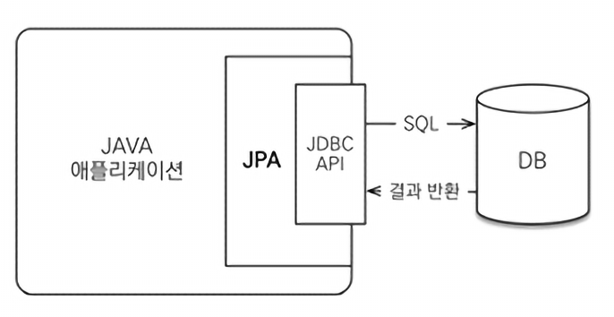
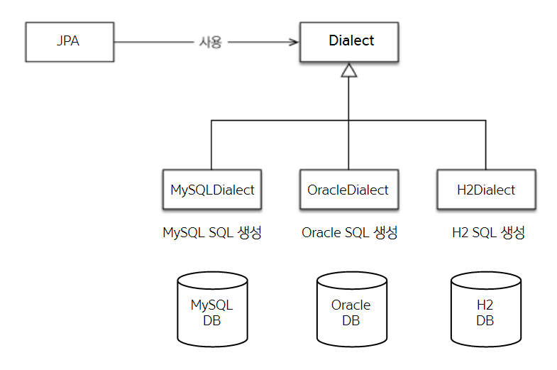

# 01 JPA 소개
## 1.1 SQL을 직접 다룰 때 발생하는 문제점

- 자바로 작성한 애플리케이션은 JDBC API를 사용해거 SQL을 데이터 베이스에 전달 해야람.

1. 비슷한 SQL 구문을 반복적으로 작성해야함.
2. SQL에 의존적인 개발을 피하기 어려워 엔티티 신뢰 불가.
3. 진정한 의미의 계층 분할이 어려움.

### 1.1.3 JPA와 문제해결
- JPA를 사용하면, 객체를 데이터베이스를 저장하고 관리할때, 직접 SQL을 작성하는게 아니라, JPA 가 사용하면 API를 사용

#### 저장기능
`jpa.persisit(member); //저장`
- persist() 메서드는 객체를 데이터베이스에 저장.
- 이 메서드를 호출하면 JPA객체와 매핑정보를 보고 적절한 INSERT SQL을 생성해 데이터베이스에 전달.

#### 조회 기능
```java
String memeberId="helloId";
Member member=jpa.find(Member.class,memeberId); // 조회
```
- find() 메서드는 객체 하나를 데이터베이스에서 조회
- JPA 객체와 매핑정보를 보고 적절한 SELECT SQL 생성해서 DB에 전달하고, 그 결과를 Member 객체를 생성해서 반환.

#### 수정 기능

```java
Member member=jpa.find(Member.class,memberId);
member.setName("이름변경"); //수정
```
- 별도의 수정 메서드를 제공하지 않고 객체의 값을 조회해서 값을 변경만하면 트랜잭션을 커밋할때 적절한 UPDATE SQL이 전달된.

#### 연관된 객체 조회
```java
Member member=jpa.find(Member.class,memberId);
Team team=member.getTeam(); //연관된 객체 조회
```

- 연관된 객체를 사용하는 시점에서 적절한 SELECT SQL 실행
- 따라서 연관된 객체를 마음껏 조회 가능.

## 1.2 패러다임의 불일치
- 패러다임 이란?
  - 어떤 한 시대 사람들의 견해나 사고를 근본적으로 규정하고 있는 테두리로서의 인식의 체계. 또는 사물에 대한 이론적인 틀이나 체계.
- 객체와 관계형 데이터 베이스가 지향하는 목적이 달라, 둘의 기능과 표현방법이 다름 즉, 패러다임의 불일치가 발생함.
- 아래는 패러다임의 불일치로 발생하는 문제들과 JPA를 통한 해결책을 기술함.

### 1.2.1 상속
- 객체는 상속이라는 기능을 가지고 있지만, 테이블은 상속의 기능이 없다.(슈퍼타입-서브타입 관계로 유사하게 구현가능)
```java
abstract class Item{
    Long id;
    String name;
    int price;
}

class  Album extends  Item{
    String artist;
}

class  Movie extends  Item{
  String director;
  String actor;
}
```
이런 객체 모델에서 Album 객체를 저장하려면 이 객체를 분해해서 다음 두 SQL을 작성해야한다.
```sql
Insert into Item...
Insset into Album ...
```

이렇게 패러다임의 불일치를 해결하기 위해 반복적인, 다량의 SQL 코드를 작성해야하는 문제가 있다.

#### **JPA와 상속**
- JPA는 상속과 관련된 패러다임 불일치를 개발자 대신 해결한다
- JPA에서 Item을 상속한 Album 객체를 저장하려면 앞에서 설명한 persisit()메서드를 사용하면 위의 sql처리를 대신 해준다.(조회도 마찬가지)

- `jpa.persisit(album)` 

### 1.2.2 연관관계
- 객체는 **참조** 를 사용해서 다른 객체와 연관 관계를 가지고 참조에 접근해서 연관된 객체를 조회함.
  → 객체는 참고가 있는 방향으로만 조회가능 
- 반면 테이블을 **외래키** 를 사용해서 다른 테이블과의 연관관계를 가지고 **조인** 을 사용해서 연관된 테이블을 
-  → 테이블은 외래키 하나로 Member JoIN TEAM, TEAM JOIN MEMBER 가능 (양방향 가능)

#### **JPA와 연관관계**
```java
member.setTeam(team); //회원과 팀 연관관계 설정
jpa.persist(member); //회원과 연관관계함께 저장.
```
위의 코드만 작성하면 JPA는 tea 참조를 외래키로 변환해서 적절한 INSERT SQL 문을 데이터베이스에 전달.

### 1.2.3 객체 그래프 탐색
- 객체 그래프 탐색이란>
  - 참조를 통해 연관된 데이터를 찾는것.
- 객체 연관관게가 그림과 같이 설계 되있다고 가정할때, 이런식으로 객체그래프를 탐색하는 코드를 짤 수 있다.
- `member.getOrder().getOrderItem()...//자유로운 객체그래프 탐색`
- 하지만 MemberDAO에서 member객체를 조회할때, 이런 SQL을 실행해서 회원과 팀에대한 데이터만 조회 했다면 `member.getTeam()`은 성곻하지만, 다음처럼 다른 객체 그래프는 데이터가 없으므로 조회가 불가능 함.

** SQL을 직접다루면 처음 실행하는 SQL에 따라 객체 그래프를 어디싸지 탐색할 수 있는지 정해진다.**
- 비즈니스 로직에 따라 객체그래프가 언제 끊어질지 몰라 함부로 탐색할수 없기에  객체지향 개발자에겐 너무 큰 제약이다

```java
import java.lang.reflect.Member;

class MemberService {
  public void process() {
    Member member=memberDAO.find(memberId);
    member.getTeam(); // member-> team 객체 그래프 탐색이 가능한가?
    member.getOrder.getDelivery();//??
  }
}
```

- 어디까지 객체 그래프 탐색이 가능한지 알아보려면 데이터 접근 계층인 DAO를 열러서 SQL을 직접 확인해야한다. -> 엔티티가 SQL에 논리적으로 종속되어 발생하는 문제.
- 결국 이렇게 되면 MemberDAO에 회원을 조회하는 메서드를 상황에따라 여러벌 만들어야함.

#### JPA와 객체그래프 탐색
- JPA를 사용하면 객체그래프를 마음껏 탐색할 수 있음.
- JPA는 연관된 객체를 사용하는 시점에서 적절한 SELECT SQL을 실핸함.
- 따라서 JPA를 사용하면 연관된 객체를 신뢰하고 마음껏 조회가 가능함. 실제 객체를 사용한는 시점까지 데이터베이스조회를 미룬다고 해서 **지연로딩** 이라고 부름
- 연관된 객체를 즉시 함께 조회할지 아니면 실제 사용되는 시점에서 지연해서 조회할지 정의가능.

### 1.2.4 비교
- 데이터베이스는 기본키의 값으로 각 로우를 구분.
- 객체는 동일성(identity)와 동등성(equality) 비교하는 두가지 방법이 있음.
  - 동일성 비교 `==` 객체 인스턴스 주소 값 비교
  - 동등성 비교 equals() 메소드를 사용해서 객체 내부의 값을 비교
  
#### JPA와 비교
- JPA는 같은 트랜잭션일 때 같인 객체가 조회 되는 것을 보장한.

### 1.2.5 정리
- 객체모델과 관계형 데이터는 지향하는 패러다임이 다르기에 필연적으로 불일치가 발생함.
- 이런 불일치 문제는 정교한 객체모델링을 할수록 더 커짐
- JPA는 이런 불일치문제를 해결해주고 정교한 객체 모델링을 유지하게 도움.
## 1.3 JPA란 무엇인가?

### JPA란?
- Java Persistence API 는 자바 진영 ORM 기술 표준이다. 
- 애플리케이션과 JDBC사이에서 동작한다.


### ORM 이란?
- Object-Relational Mapping의 약자로 객체와 관계형 데이터 베이스를 매핑한다는 의미이다.
- 패러다임 불일치 문제를 개발자 대신 해결해주기때문에 정교한 객체 모델링이 가능하다.
- 어느 정도 성숙한 객체지향 어어에는 대부분 ORM 프레임 워트가 있는데 자바는 그중 **하버네이트 프레임** 을 사용한다.

### 1.3.1 JPA 소개
- JPA는 자바 ORM 기술에 대한 API 표준 명세이다.
- 인터페이스를 모아둔 것.

### 1.3.2 왜 JPA를 사용해야 하는가?
1. 생산성
   - 지루하고 반복적인 일을 대신 처리주며, 객체 설계중심으로 패러다임을 바꿀 수 있음.
2. 유지보수
   - SQL을 중심으로 코딩시에는 엔티티에 필드 하나만 추가해도 관련된 JDBC API 코드를 모두 변경해야 했지만, JPA를 사용하면 이런 것들을 대신 처리해 주기 때문에 유지보수 해야할 코드 수가 감소한다.
3. 패러다임의 불일치 해결
   - 상속, 연관관계,객체그래프 탐색, 비교하기 와 같은 패러다임의 불일치 문제를 해결해준다.
4. 성능
5. 데이터 접근 추상화와 벤더 독립성
   - 관계형 데이터 베이스는 같은 기능도 벤더마다 사용법이 다른 경우가 많은데 JPA를 사용하면 데이터 베이스를 변경해도 JPA에게 알려주기만 하면 추가적인 작업을 하지 않아도 되어 편리하다.
   

## Q&A