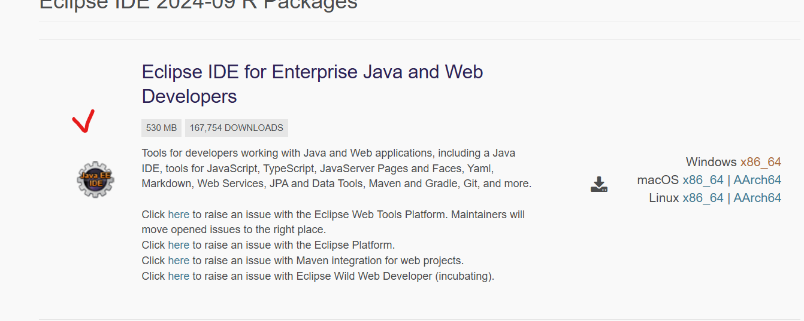
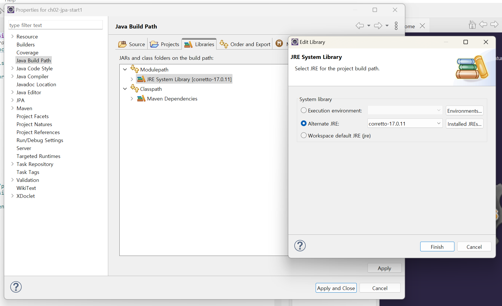
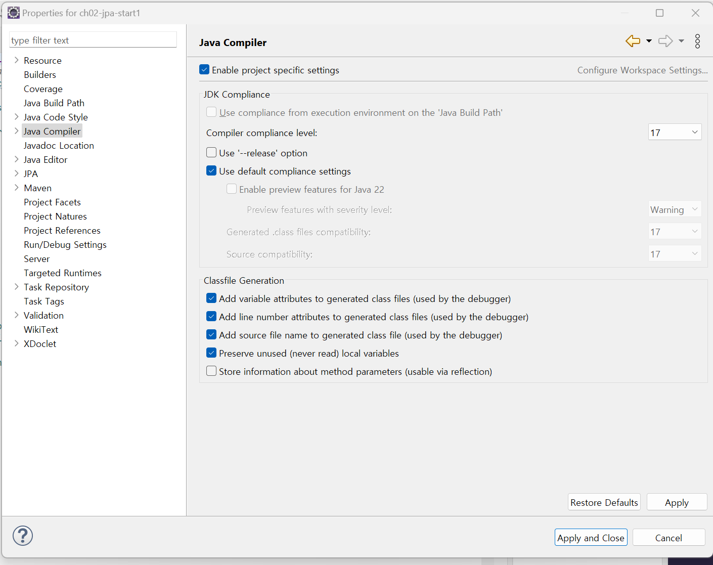
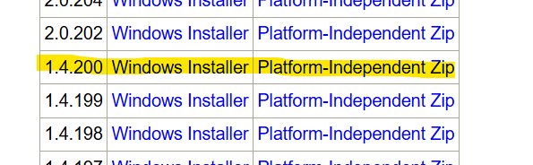
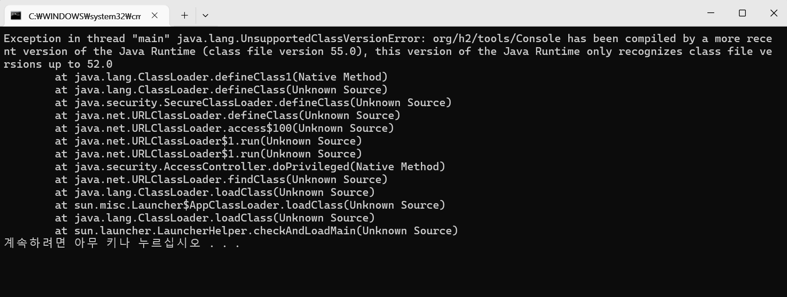
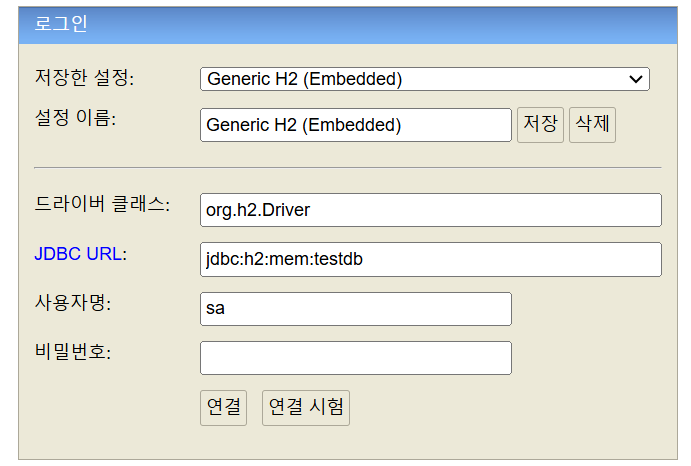
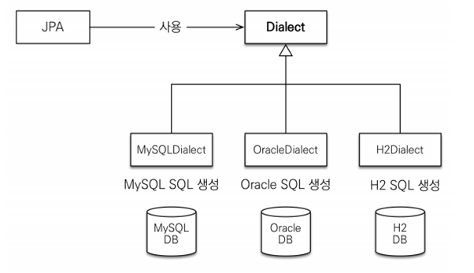
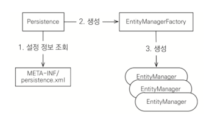

# Chapter 02 JPA 시작
## 2.1 이클립스 설치와 프로젝트 불러오기
- Eclipse IDE for JAVA EE Developers 패키지로 내려받는 걸  권장함.
- 이 패키지로 사용하면 JPA로 개발할 때 편리한 도구들이 지원됨.
- [이클립스 다운 경로](https://www.eclipse.org/downloads/packages/)


- 예제 프로젝트 불러오기
- [예제다운사이트](https://github.com/holyeye/jpabook)

**JRE 버전 문제 해결**
1. JRE가 너무 에전 버전이여서 1.8 이상으로 교체하라는 에러가 뜸
   - 우클릭 -> Properties -> JavaBuildPath-> Libraries 에서 Moudluepath 더블 클릭 -> Alternative JRE에서 버전을 올려줌

   - JavaComplie 에서 Compiler compliance level을 Buildpath에서 변경한 버전과 동일한 버전으로 설정해줌.

## 2.3 H2데이터 베이스 설치
- [설치 경로](https://www.h2database.com/html/download-archive.html)
- 책에 있는 버전은 너무 오래 되서 다운 받을 수 없었고 새로운 버전을 다운 받아야 했는데, 이것도 자바 버전에 영향을 받는다.
- Java 17은 1.4.200과 호환되어 작동 했다.



- 버전이 맞지 않는 H2 서버 작동시, 터미널에 아래와 같은 문구가 보인다.

- 각자 자바의 컴파일 버전 참고
  - [자바 컴파일 버전 참고 블로그](https://ksabs.tistory.com/185)
- H2 로그인 화면


- 예제 테이블 생성하기
```sql
create table MEMBER(
    id varchar(255) not null , -- 아이디(기본키)
    name varchar(255),         -- 이름
    age integer not null ,     -- 나이
    primary key (id)
)
```

## 2.3 라이브러리와 프로젝트 도구
- 예제에 사용할 프로젝트 도구
```markdown
src/main
|- java
|    |- jpabook/start
|             |_ JpaMain.java(실행클래스)
|             |_  Member.java(회원엔티티)
|- resource
       |- META-INF
             |- persistence.xml(JPA 설정 정보)
```

### 2.3.1 메이븐 사용 라이브러리 관리
- 메이븐이란?
  - 라이브러리를 관리해주는 도구로 pom.xml에 사용할 라이브러리를 적어주면 자동으로 내려받아 관리해준다.
- pom.xml 살펴보기
    ```xml
    <?xml version="1.0" encoding="UTF-8"?>
    <project xmlns="http://maven.apache.org/POM/4.0.0" xmlns:xsi="http://www.w3.org/2001/XMLSchema-instance"
        xsi:schemaLocation="http://maven.apache.org/POM/4.0.0 http://maven.apache.org/xsd/maven-4.0.0.xsd">
        <modelVersion>4.0.0</modelVersion>
    
        <groupId>jpabook</groupId>
        <artifactId>ch02-jpa-start1</artifactId>
        <version>1.0-SNAPSHOT</version>
    
        <properties>
    
            <!-- 기본 설정 -->
            <java.version>1.6</java.version>
            <!-- 프로젝트 코드 인코딩 설정 -->
            <project.build.sourceEncoding>UTF-8</project.build.sourceEncoding>
            <project.reporting.outputEncoding>UTF-8</project.reporting.outputEncoding>
    
            <!-- JPA, 하이버네이트 버전 -->
            <hibernate.version>4.3.10.Final</hibernate.version>
            <!-- 데이터베이스 버전 -->
            <h2db.version>1.4.187</h2db.version>
    
        </properties>
    
    
        <dependencies>
            <!-- JPA, 하이버네이트 -->
            <dependency>
                <groupId>org.hibernate</groupId>
                <artifactId>hibernate-entitymanager</artifactId>
                <version>${hibernate.version}</version>
            </dependency>
            <!-- H2 데이터베이스 -->
            <dependency>
                <groupId>com.h2database</groupId>
                <artifactId>h2</artifactId>
                <version>${h2db.version}</version>
            </dependency>
        </dependencies>
    
        <build>
            <plugins>
                <plugin>
                    <groupId>org.apache.maven.plugins</groupId>
                    <artifactId>maven-compiler-plugin</artifactId>
                    <version>3.1</version>
                    <configuration>
                        <source>${java.version}</source>
                        <target>${java.version}</target>
                    </configuration>
                </plugin>
            </plugins>
        </build>
    
    </project>
    ```

    - `<dependencies>`에 사용할 라이브러리를 지어함다.
    - groupId+artifactId+version 만 적어주면 라이브러리를 메이블 공식 저장소에서 내려받아 추가해준다.

- JPA에 하버네이트 구현체를 사용하기위한 핵심 라이브러리
  - JPA , 하버네이트(hibernate-entitymanager): JPA 표준과 하버네이트를 포함하는 라이브러리를 hibernate-entitymanager 로 지정하면 다음과 같은 라이브러리도 함께다운 받는다.
    - hibernate-core.jar
    - hibernate-jpa-2.1-api.jar
  - H2 데이터 베이스: H2 데이터 베이스에 접속해야 함.

## 2.4 객체 매핑 시작
- 애플리케이션에서 사용할 회원 클래스 만들기
```java
package jpabook.start;

import javax.persistence.*;  //**

/**
 * User: HolyEyE
 * Date: 13. 5. 24. Time: 오후 7:43
 */
@Entity
@Table(name="MEMBER")
public class Member {

    @Id
    @Column(name = "ID")
    private String id;

    @Column(name = "NAME")
    private String username;

    private Integer age;

    public String getId() {
        return id;
    }

    public void setId(String id) {
        this.id = id;
    }

    public String getUsername() {
        return username;
    }

    public void setUsername(String username) {
        this.username = username;
    }

    public Integer getAge() {
        return age;
    }

    public void setAge(Integer age) {
        this.age = age;
    }
}

```
- `@Entity`
  - 이 클래스를 테이블고 매핑한다고 JPA에게 알려주는 어노테이션.
  - 이 어노테이션이 사용된 엔티티 클래스라고 함.
- `@Table`
  - 엔티티 클래스에 매핑할 테이블 정보를 알려준다.
  - name 속성을 사용해서 따로 이름을 지정하지 않을시, 클래스이름을 테이블 이름으로 매핑한다. (정확히는 엔티티 이름을 사용함)
-  `@Id`
  - 엔티티 클래스의 필드를 테이블의 기본 키 (primary key)에 매핑함ㄴ다.
  - 이렇게 이 어노테이션이 사용된 필드를 식별자 필드라 한다.
- `@Column`
  - 필드를 컬럼에 매핑한다.
  - name  속성을 사용해서 Member엔티티의 username 필드를 Member 테이블의 name 컬럼에 매핑했다.
- 매핑 정보가 없는 필드
  - 매핑 어노테이션을 생략하면 필드명을 사용해서 컬럼명으로 매핑한다.
  - 여기서는 필드명이 age이므로 age 컬럼으로 매핑한다.(여기서는 데이터 베이스가 대소문자를 구분하지 않는다고 가정한다)

## 2.5 persistence.xml 설정
- JPA는 persisitence.xml을 사용해서 필요한 설정 정보를 관리한다.
- 이 설정 파일이 META-INF/persisitence.xml 클래스 패스 경로에 있으면 별도의 설정 없이 JPA가 인식 가능

```xml
<?xml version="1.0" encoding="UTF-8"?>
<persistence xmlns="http://xmlns.jcp.org/xml/ns/persistence" version="2.1">

    <persistence-unit name="jpabook">

        <properties>

            <!-- 필수 속성 -->
            <property name="javax.persistence.jdbc.driver" value="org.h2.Driver"/>
            <property name="javax.persistence.jdbc.user" value="sa"/>
            <property name="javax.persistence.jdbc.password" value=""/>
            <property name="javax.persistence.jdbc.url" value="jdbc:h2:tcp://localhost/~/test"/>
            <property name="hibernate.dialect" value="org.hibernate.dialect.H2Dialect" />

            <!-- 옵션 -->
            <property name="hibernate.show_sql" value="true" /> <!-- 하버네이트가 실행항 SQL출력 -->
            <property name="hibernate.format_sql" value="true" />  <!-- 하버네이트가 실행한 sql은 보기쉽게 정렬-->
            <property name="hibernate.use_sql_comments" value="true" /><!-- 쿼리를 출력할떄 주석도 추가-->
            <property name="hibernate.id.new_generator_mappings" value="true" /><!-- JPA표준에 맞춘 새로운 키 생성 전략사용-->

            <!--<property name="hibernate.hbm2ddl.auto" value="create" />-->
        </properties>
    </persistence-unit>

</persistence>
```
- `<persistence xmlns="http://xmlns.jcp.org/xml/ns/persistence" version="2.1">`
  - 설정 파일은 persisitence로 시작한다. 이곳에 XML 네임 스페이스와 사용할 버전을 지정
- `<persistence-unit name="jpabook">`
  - JPA 설정은 영속성 유닛 이라는 것부터 시작한다
  - 일반적으로 연결할 데이터 베이스당 하나의 영속성 유닛을 등록하며, 각각의 고유한 이름을 부여한다
- JPA 표준 속성
  - `javax.persistence.jdbc.driver`: JDBC 드라이버
  - `javax.persistence.jdbc.user` : 데이터베이스 접근 아이디
  - `javax.persistence.jdbc.password` : 데이터베이스 접속 비밀번호
  -  `javax.persistence.jdbc.url`: 데이터 베이스접근 url
- 하버네이트 속성
  - `hibernate.dialect` : 데이터베이스 방언 설정
- 이름이 javax.persistence 로 시작하는 속성은 JPA 표준속성으로 특정 구현체에 족송되지 않음.
- 반면 hibernate로 시작하는 속성은 하버네이트 전용 속성이므로 하버네이트에서만 사용가능

### 2.5.1 데이터베이스 방언
#### 데이터 베이스마다의 차이
- 데이터 타입: 가변문자 타입으로 MYSQL은 varchar, 오라클은 varchar2를 사용함
- 다른 함수명: 문자열을 자르는 함수
- 페이징 처리

- 이처럼 SQL 표준을 지키지 않거나 특정 데이터베이스만의 고유한 기능을 JPA에서는 방언이라 함.
- 개발자는 JPA가 제공하는 표준 문법에 맞추어 JPA를 사용하면 되고, 특정 데이터베이스에 의존적인 SQL은 데이터베이스 방언이 처리해준다
- 데이터베이스 방언을 설정하느 방법은 JPA에 표준화 되어있지 않다.

- 대표적인 방언
  - H2: org.hibernate.dialect.H2Dialet
  - 오라클
  - MYSQL
  - [그외 지원항목 참고]()

## 2.6 애플리케이션 개발
### 2.6.1 엔티티 매니저 설정

- 엔팉 매니저 팩토리 구성
  - JPA를 시작하려면 우선 persisitence.xml 설정 정보를 사용해서 엔티티 매니저 팩토리를 생성해야함.
  - 이때 `Persistence`클래스를 사용하는데, 이 클래스는 엔티티 매니저 팩토리를 생성해서 JPA를 사용할수 있게 준비함.
  ```java
  EntityManagerFactory emf = Persistence.createEntityManagerFactory("jpabook");
  ```
  - META-INF/persistence.xml 에서 이름이 jpabook인 영속성 ㅇ닛을 찾아서 엔티티 매니저 팩토리를 생성함.
  - 설정 정보를 읽어서 JPA를 동작시키기 위한 기반 객체를 만들고 JPA 구현체에 따라서는 데이터베이스 커넥션 풀도 생성함.
  - 따라서 엔티티 매니저 팩토리를 생성하는 비용이 아주 크므로 애플리케이션 **전체에 딱 한번만 생성하고 공유해서 사용해야함.**
- 엔티티매니저 사용
  - 엔티티 매니저 팩토리에서 생성함
  - JPA 대부분의 기능을 제공함 , 대표적으로 등록/수정/삭제/조회
  - 내부에 데이터 소스를 유지하면서 데이터 베이스와 통신
  - 엔티티매니저는 데이터베이스 커넥션과 밀접한 관련이 있으므로, **스레드간에 공유하거나 재사용하면 안됨**
- 종료
  - 사용이 끈난 엔티티 매니저는 반드시 다음과 같이 종료하기
  - 애플리케이션을 종료할때 엔티티 매니저 팩토리도 다음처럼 종료하기
### 2.6.2 트랜젝션 관리
- JPA를 사용하려면 항상 트랜잭션 안에서 데이터를 변경해야함
- 트랜잭션없이 데이터를 변경하면 예외가 발생.
- 트랜 잭션을 시작하려면 엔티티 매니저에서 트랜잭션 API를 받아와야 함.
```java
  EntityTransaction tx = em.getTransaction(); //트랜잭션 API

        try {


            tx.begin(); //트랜잭션 시작
            logic(em);  //비즈니스 로직
            tx.commit();//트랜잭션 커밋

        } catch (Exception e) {
            e.printStackTrace();
            tx.rollback(); //트랜잭션 롤백
        } 
```

### 2.6.3 비즈니스 로직
- 회원 엔티티를 하나 생성한 다음 엔티티 매니저를 통해 데이터 베이스에 등록,수정,삭제 조회를 진행
```java
    public static void logic(EntityManager em) {

        String id = "id1";
        Member member = new Member();
        member.setId(id);
        member.setUsername("지한");
        member.setAge(2);

        //등록
        em.persist(member);

        //수정
        member.setAge(20);

        //한 건 조회
        Member findMember = em.find(Member.class, id);
        System.out.println("findMember=" + findMember.getUsername() + ", age=" + findMember.getAge());

        //목록 조회
        List<Member> members = em.createQuery("select m from Member m", Member.class).getResultList();
        System.out.println("members.size=" + members.size());

        //삭제
        em.remove(member);

    }
```
- 등록
```java
  String id = "id1";
  Member member = new Member();
  member.setId(id);
  member.setUsername("지한");
  member.setAge(2);

  //등록
  em.persist(member);
```
  
  - 엔티티를 저장하기 위해 엔티티 매니저의 persist()메소드에 저장할 엔티티를 넘겨주면됨.
  - 그러면 JPA는 회원 매핑 정보를 분석해 아래와 같은 SQL을 데이터에 전달
    - `INSERT INTO MEMBER(ID,NAME,AGE) VALUES ('id1','지한',2)`
- 수정
- `member.setAge(20);`
  - JPA는 어떤 엔티티가 변경되었는지 추적하는 기능을 갖추고 있어서 엔티티의 값만 변경하면 update 문을 생성해서 데이터 베이스에 값을 변경함
- 삭제
  - `em.remove(member);`
    - 엔티티 매니저의 remove()메스드에 삭제하려는 엔티티를 넘겨주면 delete 문을 생성하여 실행함.
- 한 건 조회
  - ` Member findMember = em.find(Member.class, id);`
    - find() 메소드는 조회할 엔티티 타입과 @ID로 데이터베이스 테이블의 기본키와 매핑한 식별자 값으로 엔티티 하나를 조회하는 가장 단순한 조회 메서드이다.
    - 이 메서드를 호출하면 다은 select sql을 생성해서 데이터베이스에 결과를 조회한고 그 결과 값으로 엔티티를 생성해서 반환한다.
      - `SELECT * FROM MEMBER WHERE ID='id1'`
### 2.6.4 JPQL
`List<Member> members = em.createQuery("select m from Member m", Member.class).getResultList();`
- JPA는 엔티티 객체를 중심으로 개발하므로 검색할때도 테이블아닌 엔티티 객체를 대상으로 검색해야함.
- 그러나 테이블이 아닌 엔티티 객체를 대상으로 검색하려면 데이터 베이스릐 모든 데이터를 애플리케이션으로 불어와 엔티티객체로 변경후 검색을 해야하는데 사실상 불가능함.
- 그래서 결국 검색 조검이 포함된 SQL을 사용해야되는데 JPA는 **JPQL**이라는 쿼리언어로 이를 해결함
- **JPQL** 이란??
  - SQL을 추상화한 객체지향 쿼리언어
  - 데이터베이스 테이블을대상으로 쿼리하는 SQL과 달리 JPQL은 **엔티티 객체** 대상으로 쿼리한다. 즉, 클래스와 필드를 대상으로 쿼리한다.
  - 따라서 JPQL은 데이터베이스 테이블을 전혀 알지 못한다.
  - JPQL을 사용하기 위해, em.createQUery(JPQL,반환타입) 메소드를 실행해서 쿼리 객체를 생성한후, getResultList() 메소드를 호출하면 적절한 SQL을 만들어 데이터를 조회한다.