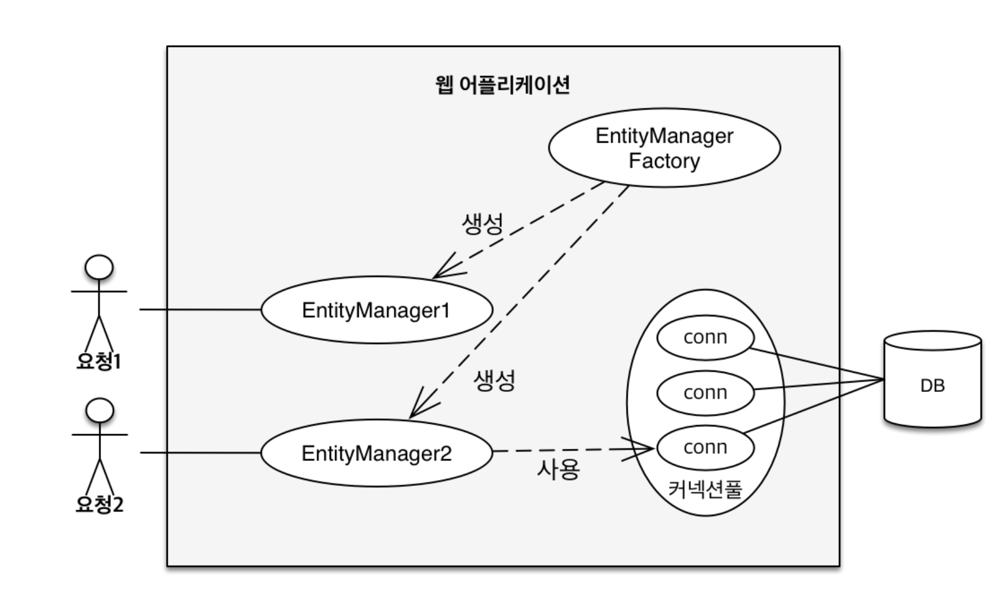
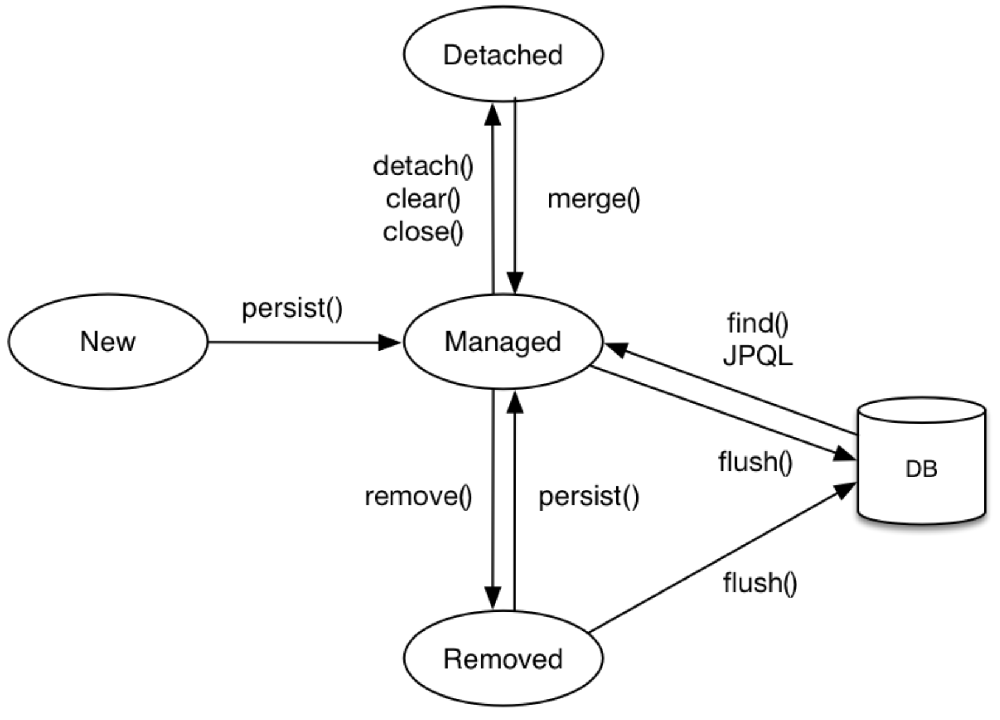
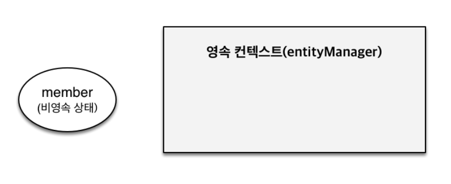
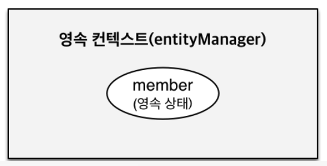
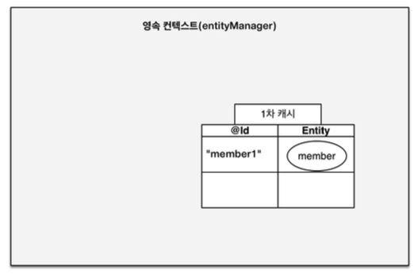
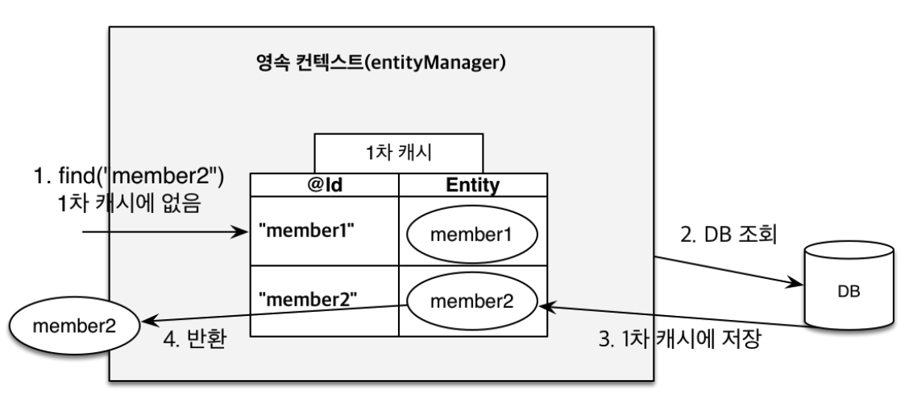
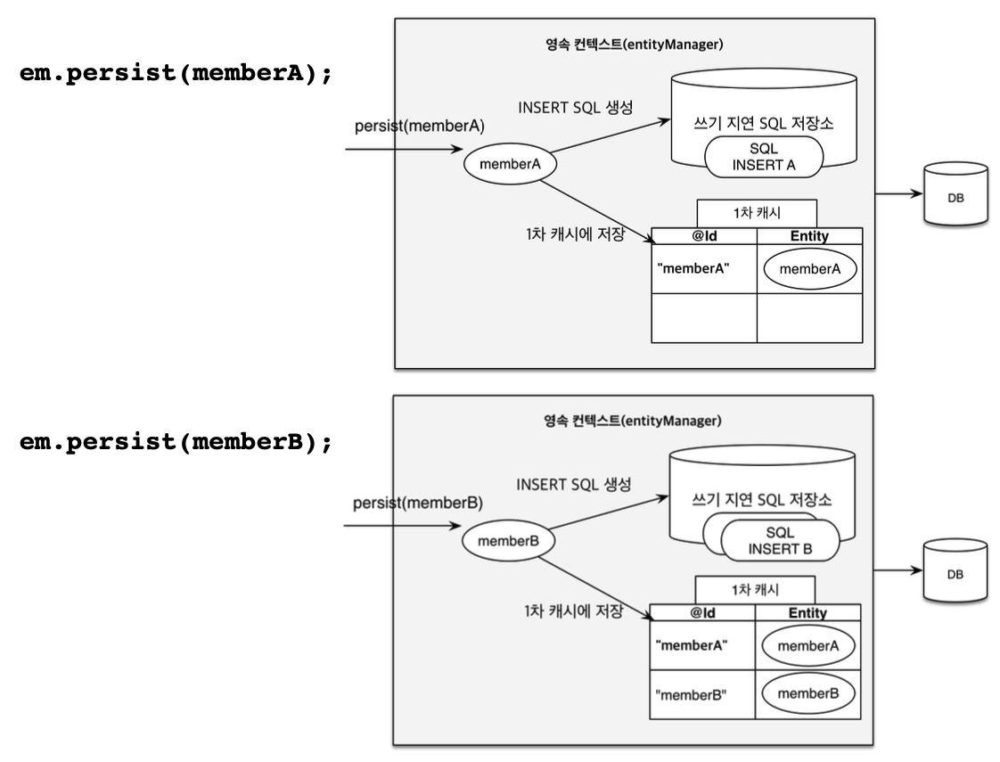
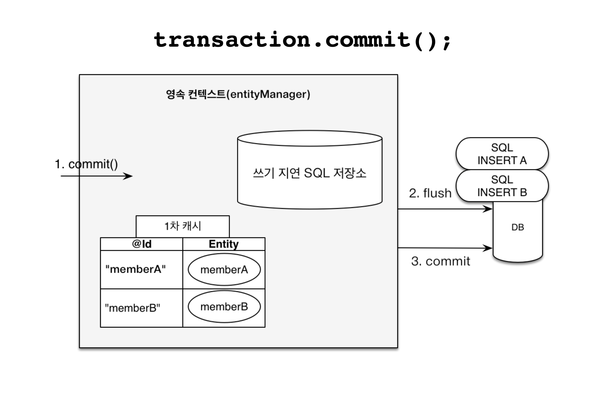
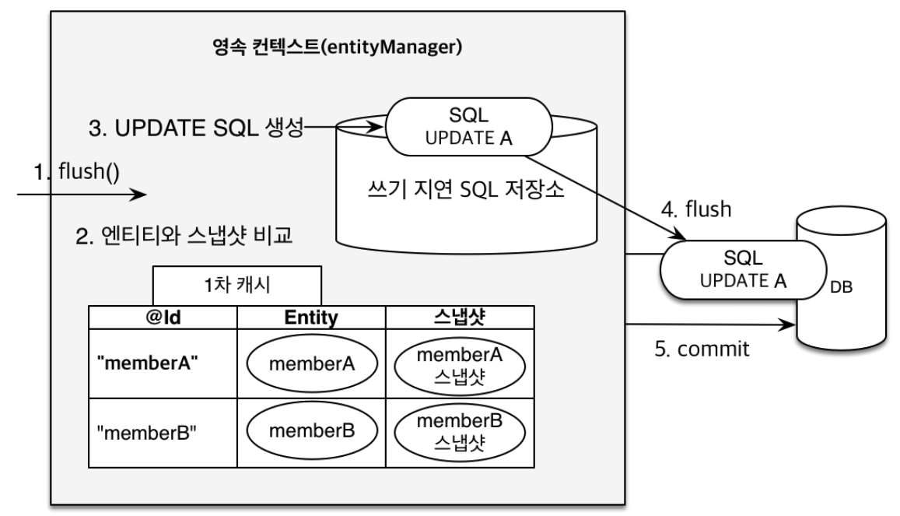

# 03 영속성 관리
## 3.1 엔티티 매니저 팩토리와 엔티티 매니저
- JPA 가 제공하는 기능은 크게 2가지로 나눌 수 있음
  - 엔티티와 테이블을 매핑하는 설계부분
  - 매핑한 엔티티를 실제 사용하는 부분
- 엔티티 매니저 (entity manager)란?
  - 엔티티와 관련된 모든 일(저장,수정,삭제,조회 ..)을 처리 하는 관리자

- 데이터 베이스를 하나만 사용하는 애플리 케이션은 일반적으로 EntityManagerFactory를 하나만 생성함.
- `Persistence.createEntityManagerFactory("jpabook");`을 호출하면, persistence.xml에 있는 정보를 바탕으로 EntityManagerFactory를 호출함
- 이제 부터 필요할때 마다 엔티티 팩토리에서 엔티티 매니저를 생성 가능함
- 엔티티 매니저 팩토리와 엔티티 매니저

  | 엔티티 매니저 팩토리                              | 앤티티 매니저                                  |
    |------------------------------------------|------------------------------------------|
|공 장은 만드는 데 비용이 많이듬 -> 한개만 제작후 애플리케이션 전체 공유 | 공장에서 찍어내는 상품은 가격이 저렴함. -> 여러개 제작해서 사용 가능 |
|  여러스레드가 동시에 접근해도 안전하여 서로 다른 스레드간에 공유 가능   | 여러 스레드가 접근하면 동시성 문제 발생하므로 공유 불가          |


- 엔티티 매니저는 연결이 필요한 시점까지는 커넥션을 얻지 않으며, 보통 트랜잭션을 시작할때, 커넥션을 획득함.
- 또한 하버네이트 포한 JPA 구현체들은 엔티티매니저팩토리를 만들때 커넥션풀도 만드는데 J2SE 환경에서 사용하는 방법이다.
- JPA를 J2EE환경(스프링 프레임워크 포함)에서 사용하면 해당 컨테이너가 제공하는 데이터 소스를 사용함

## 3.2 영속성 컨텍스트란?
- **엔티티를 영구 저장하는 환경** 을 의미한.
  - 엔티티 매니저로 엔티티를 저장하거나 조회하면, 엔티티 매니저는 영속성 컨텍스트에 엔티티를 보관하고 관리함.
- `em.perisit(member)`
  - 단순히 회원 엔티티를 저장하는 것이아니라, **엔티티 매니저를 사용해서 회원엔티티를 영속성 컨텍스트에 저장**
## 엔티티의 생명 주기

### 비영속(new/transient)
- 엔티티의 객체를 생성함. 순수한 객체 상태이며 아직 저장되지 않은 상태.
- 따라서 영속성 컨텍스트나 데이터 베이스와는 전혀관련이 없는 상태를 지칭함.

```java
Member member = new Member();
member.setId("1");
member.setUsername("회원1");
```


### 영속
- 엔티티 매니저를 통해 엔티티를 영속성 컨텍스트에 저장하여 영속성 컨텍스트가 관리하는 엔티티의 상태
- `em.find()`니 JPQL을 사용해서 조회한 엔티티도 영속성 컨텍스트가 관리하는 영속상태임
- `em.persist(member);`


### 준영속
- 영속성 컨텍스트가 관리하던 영속상태의 엔티티를 영속상태가 관리하지 않는 상태
- `em.detach()`나 `em.close()` 를 호출해서 영속성 컨텍스트를 닫거나, `em.clear()` 호출해서 영속성 컨텍스트 초기화를 해도 영속상태의 엔티티가 준영속 상태가 됨.

### 삭제
- 엔티티를 영속성 컨텍스트와 데이터 베이스에서 삭제함
  -`em.remove(member);`

## 3.4 영속성 컨텍스트의 특징
- 영속성 컨텍스트와 식별자 값
  - 영속성 컨텍스트는 엔티티를 식별자값(@ID로 테이블 기본키와 매핑한 값)으로 구분하기때문에 **영속상태는 식별자 값이 반드시 있어야 한다.**
- 영속성 컨텍스트와 데이터 저장
  - 플러시(flush)란?
    - JPA는 보통 트랜잭션을 커밋하는 순간, 영속성 컨텍스트에 새로 저장된 엔티티를 데이터 베이스에 반영함
- 영속성 컨텍스트가 엔티티를 관리하면 오는 장점
  - 1차 캐시
  - 동일성 보장
  - 트랜잭션을 지원하는 쓰기 지원
  - 변경 감지
  - 지연 로딩
### 3.4.1 엔티티 조회
  - 1차 캐시란?
    - 영속성 컨텍스트가 내부에 가지고 있는 캐시
    - 내부에 Map이 하나 있는데 키는 @Id로 매핑한 식별자고 값은 엔티티인 인스턴스
    ```java
    Member member = new Member();
    member.setId("1");
    member.setUsername("회원1");
    //엔티티를 영속
    em.persist(member);
    ```
    - 위의 코드를 실행ㅎ면 아래 그림처럼 1차 캐시에 저장됙고 아직 **데이터 베이스에 저장되지 않은 상태**
    
    - 1차 캐시의 키는 식별자 값이기때문에 영속성 컨텍스트에 저장하고 조히하는 모든기준은 데이터베이스의 기본키 값
    - find() 메소드
      ```java
      //EntityManager.find()정의
      public<T> find(Class<T> entityClass,Object primaryKey);
      ```
    - 첫 번째 파라미터는 엔티티 클래스 타입이고 두번째는 식별자 값
    em.find() 실행시, 1차캐시에서 엔티티를 찾고 없으면 데이터 베이스에서 조회

#### 1차 캐시에서 조회
- em.find() 호출시, 우선적으로 1차 캐시에서 식별자 값으로 엔티티를 찾아서 찾는 엔티티가 있을시 데이터베이스를 조회하지 않고 값을 반환함.

#### 데이터 베이스에서 조회
1.em.find()를 실행
2. member2가 1차 캐시에 없으므로 데이터 베이스에서 조회
3. 조회한 데이터로 member2 엔티티를 생성해서 1차캐시에저장(영속상태)
4. 조회한 엔티티 반환.
- 이제 member1,member2는 1차 캐시에 존재하여 이둘을 조회할때 1차 캐시에서 바로 불러올 수 있어 성능상 이점이 있다.


#### 영속성 엔티티의 동일성 보장
- 같은 엔티티를 반복해서 호출해도 영속성 컨텍스트는 1차 캐싱에 있는 같은 엔티티 인스턴스를 반환함
- 따라서 성능상 이점과 엔티티의 동일성을 보장

####  ⚠️ 동일성과 동등성
- 동일성(**identity**): 실제 인스턴스가 같아 참조값을 비교하는 `==` 비교의 값이 같다.
- 동등성(**equality**): 실제 인스턴스는 다를 수 있지만 인스턴스가 가지고 있는 값이 동일하다. 자바에서 동등성 비교는 equals() 메서드를 구현

## 3.4.2 엔티티 등록
```java
    EntityManagerFactory emf = Persistence.createEntityManagerFactory("jpabook");
    EntityManager em = emf.createEntityManager(); //엔티티 매니저 생성
    //엔티티 매니저는 데이터 변경시 트랜잭션을 시작해야한다.
    EntityTransaction transaction = em.getTransaction(); //트랜잭션 기능 획득
    transaction.begin(); //트랜잭션 시작
    em.persist(memberA);
    em.persist(memberB);
    //여기까지 Insert문은 SQL 데이터 베이스에 보내지 않는다.
    
    //커밋하는 순간 데이터베이스에 insert문을 보냉다
    transaction.commit(); //트랜잭션 커밋
```
### 쓰기 지연이란?
- 엔티티 매니저가 트랜잭션을 커밋하기 직전까지 데이터베이스에 엔티티를 저장하지 않고 내부 쿼리저장소에 sql문을 모아두는 행위.
- 
-  memberA를 영속한후 영속성컨텍스트는 1차캐시에 회원엔티티를 저장하면서 동시에, 회원 엔티티정보로 등록쿼리를 만든다
- 그리고 이런 쿼리를 지연 SQL 저장소에 보관하다가 commit 요청이 들어오면 그때 영속성 컨택스트를 플러쉬하려 변경내용을 데이터 베이스에 동기화한후, 쓰기지연 SQL 저장소에 모인 쿼리를 데이터베이스에 보낸다.


### 트랜잭션을 지원하는 쓰기 지연이 가능한 이유
- 커밋직전에만 데이터베이스에 SQL을 전달하면 되기 때문에 가능하며, 성능 최적화에도 유리함

## 3.4.3 엔티티 수정
### SQL 수정 쿼리의 문제점
- 요구사항이 늘어나면 수정쿼리가 증가하면서 비즈니스 로직을 분석하기위해 계속 SQL에 의존하여 확인절차를 거쳐야함.

### 변경 감지란?
- 엔티티의 변경사항을 데이터 베이스에 자동으로 반영하는 기능.
- 변경감지는 **영속상태의 엔티티에만 적용**된다.
- 엔티티를 영속성 컨텍스트에 보관할때, 최종 상태를 복사해서 저장해두는데 이를 **'스냅샷'** 이라고 한다
- 플러시 시점에 이 스냅샷과 엔티티를 비교해서 변경된 엔티티를 찾는다
- 
1. 트랜잭션을 커밋하면 엔티티 매니저 내부에서 먼저 플러시 호출
2. 엔티티와 스냅샷을 비교해서 변경된 엔티티 찾기
3. 변경된 엔티티가 있으면 수정쿼리를 생성해서 쓰기지연 SQL 저장소에 저장
4. 쓰기지연 저장소의 SQL을 데이터 베이스에 보냄
5. 데이터베이스 트랜잭션을 커밋
- 특징
- 수정된 데이터만 반영하려는  SQL UPDATE문과는 달리, JPA는 모든 필드를 업데이트한다
- 모든 필드를 업데이트하면 수정쿼리가 항상 같다 애플리케이션 로딩 시점에 수정쿼리를 미리 생성해두고 재사용이 가능하다
- 데이터베이스에 동일한 쿼리를 보내면 데이터베이스는 이전에 한번 파싱된 쿼리를 재사용가능하다.

#### @org.hibernate.annotation.DynamicUpdate
- 필드가 많거나 저장되는 내용이 크면 이 어노테이션을 사용해서 동적으로 UPDATE SQL 전략을 선택할 수 있다
- 상황에 따라 다르지만 컬럼이 30개가 넘어가면 생각해볼수 있는 전략이다.

### 3.4.4  엔티티 삭제
- 삭제 대상 엔티티를 조회한후 (find) remove()를 이용해 엔티티를 삭제한다
- 이 경우에도 쓰기지연이 이뤄진다
- 이렇게 삭제된 엔티티는 재사용하지말고 자연스럽게 가비지 컬렉션 대상이 되도록 둔다.
## 3.5 플러시
- **영속성 컨텍스트의 내용을 데이터베이스에 반영** (영속성 컨텍스트에 보관된 엔티티를 지우는게 아님!)
- 1. 변경 감지가 동작해서 영속성컨텍스트에 있는 모든엔티티를 스냅샷과 비교해서 수정된 엔티티를 찾고, 수정된 엔티티는 수정쿼리를 만들어 쓰기지연 SQL 저장소에 등록
- 2. 쓰기지연 SQL 저장소의 쿼리를 데이터베이스에 전송

- 영속성 컨텍스트를 플러시하는법
1. `em.flush()`로 직접 호출: 테스나 다른 프레임워크와 JPA를 사용할때 제외하고 거의 사용안함
2. 트랜잭션 커밋시 자동 호출
   - 데이터베이스에 변경내용을 SQL로 전달하지 않고 트랜잭션만 커밋시에 어떤 데이터도 데이터 베이스에 반영되지 않음.
   - **커밋하기 전에 무조건 플러시를 호출해서 영속성 컨텍스트 내용을 데이터베이스에 반영해야함**채
   - 이런 문제를 예방하기 위해 JPA는 트랜잭션을 커밋할때 플러시를 자동 호출
3. JPQL 쿼리 실행시 자동 호출
### 3.5.1
- java.persistence.FlushModeType
  - FlushModeType.AUTO : 커밋이나 쿼리를 실행할때 플러시(기본값)
  - FlushModeType.COMMIT : 커밋할때만 플러시
- `em.setFlushMode(FlushModeType.COMMIT)` 이런 방법으로 플러시모드를 직접 설정함.  

## 3.6 준영속
- 영속 상태의 엔티티가 영속성 켄텍스트에서 분리된것
- 영속성 컨텐스트가 제공하는 기능을 사욯 할수 없음.
- 준영속 상태를 만든법
  - em.detach(entity): 특정 엔티티만 준영속 상태로 전환
  - em.clear(): 영속성 컨텍스트를 완전 초기화
  - em.close(): 영속성 컨텍스트를 종료
### 3.6.1 detach()
- 이 메소드를 호출한 순간 1차 캐시부터 쓰기지연  SQL 저장소까지 해당 엔티티를 관리하기 위한 모든 정보가 제거됨.
### 3.6.2 clear()
- 영속성 컨텍스트를 초기화 하여 해당 영속성 컨텍스트의 모든 엔티티를 준영속 상태로 만듬.
```java
//엔티티 조회, 영속상태
Member member=em.find(Member.class,"memberA");
em.clear(); //영속성 컨텍스트 초기화
//준영속 상태
member.serUsername("changeName"); //반영되지 않음.
```

### 3.6.3 close()
- 영속성 컨텍스트를 종료하면 해당 영속성 컨텍스트가 관리하던 영속 상태의 엔티티가 모두 준영속 상태가됨.

### 3.6.4  준영속 상태의 특징
- 거의 비영속 상태에 가까움
- 이미 한번 영속상태여서 반드시 식별자 값을 가지고 있음
- 지연 로딩 불가

### 3.6.5 병합 : merge()
- 다시 영속 상태로 변경하기 위한 방법
- merge() 메소드는 준영속 상태의 엔티티를 받아서 그 정보로 새로운 영속 상태의 엔티티를 반환함.
- merge() 메소드 정의
  `public <T> T merge(T entity);`

#### 준영속 병합
- 다음은 준영속 상태의 엔티티를 영속 상태로 변경하는 예제이다
```java
public class ExampleMergeMain{
    static EntityManagerFactory emf=
            Persistence.createEntityManagerFacroty("jpabook");
    public void main(){
        Member member=createMember("memberA")
    }
}
```
