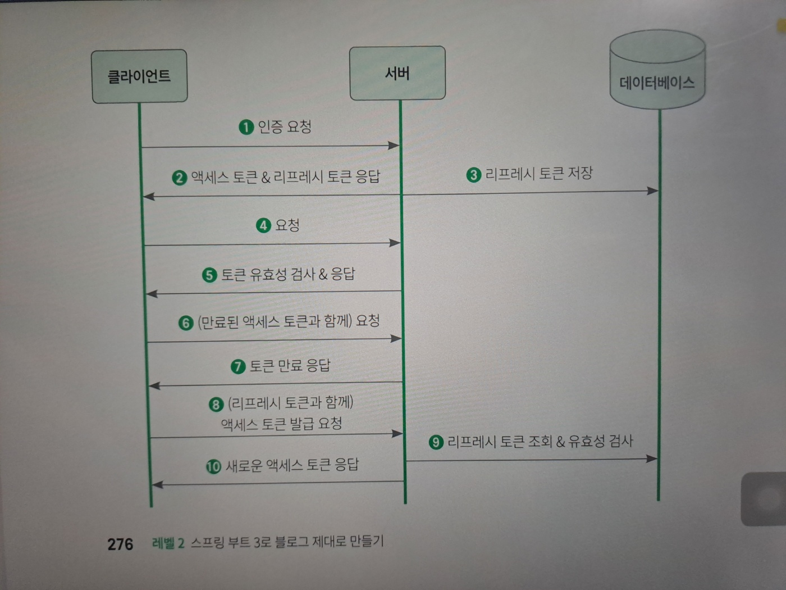

# 09 Jwt로 로그인/ 로그아웃 구현 하기
## 1. 사전 지식: 토큰 기반 인증
### 토큰 기반 인증이란?
- 토큰을 이용하여 사용자가 인증된 사용자인지 확인 하는 방법
- 토큰 이란?
  - 서버에서 클라이언트 구분을 위한 유일한 값
  - 서버가 토큰을 생성해 클라이언트에 제공하면, 클라이언트는 이 토큰을 가지고 있다가 여러 요청을 이 토큰과 함께 신청함.
#### 토큰을 전달 하고 인증 받는 과정
1. 클라이언트가 이이디와 비밀 번호를 서벙게 전달하면서 인증을 요청
2. 서버는 아이디와 비밀 번호를 확인해 유효한 사용자인지 검증한 후, 유효한 사용자면 토큰을 생성해서 응답.
3. 클라이언트는 서버가 준 토큰을 저장
4. 이후 인증이 필요한 API를 사용할때 토큰과 함께 요청을 보냄
5. 서버가 토큰 이 유효한지 확인후 요청한 내용 처리

#### 토큰 기반의 인증의 특징
1. 무상태성
- 사용자 인증 정보가 담겨있는 토큰을 클라이언트가 가지고 있으므로 서버가 상태관리를 하지 않아도 되기때문에 완전히 무상태로 효율적인 검증을 할수 있음.
2. 확장성
- 무상태성을 가지고 있으므로 서버를 확장시 상태관리를 신경쓸 필요가 없어 편리함.
- 또한 토큰 기반 인증을 사용하는 다른 시스템에 접근해 로그인 방식을 확장 할수도 있으며, 이를 활용해 다른 서비스에 권한을 공유 할수도 있음.
3. 무결성
- 토큰 방식은 HMAC(hash-based message authentication)기법이라고도 부름.
- 즉, 토큰을 발금한 이후 토큰 정보를 변경하는 행위를 할수 없음-> 무결성이 보장됨.

### JWT
- 발급 받은 JWT를 이용해 인증을 하려면 HTTP 요청 헤더 중에 Ahthorization 키값에 Bearer +JWT 토큰 값을 넣어 보내야 함.
#### JWT의 구조
- 헤더.내용.서명 으로 구성됨
- 헤더
  - 토큰의 타입과 해싱 알고리즘을 지정하는 정보를 담음
  - typ: 토큰의 타입을 지정함 "JWT"라는 문자열이 들어가게 됨.
  - alg: 해싱 알고리즘을 지정.
- 내용
  - 토큰 과 관련된 정보를 담음
  - `클레임(claim)`: 내용의 한덩어리로 키값의 한쌍으로 이루어져 있음.
  - 클레임은 등록된 클레임,공개 클레임,비공개 클레임으로 나눌 수 있음.
  - 등록된 클레임: 토큰에 대한 정보를 담는데 사용

  | 이름  | 설명                                                                                              |
  |-----|-------------------------------------------------------------------------------------------------|
  | iss | 토큰발급자(issuer)                                                                                   |
| sub | 토큰 제목(subject)                                                                                  |
| aud | 토큰 대상자(audience)                                                                                |
| exp | 토큰 만료 시간, 시간은 NumericDate 형식으로 하며(ex) 1480849147370), 항상 현재 시간 이후로 설정                           |
| nbf | 토큰의 활성 날짜와 비슷한 개념으로 nbf는 Not before를 의미한. NumericDate형식으로 날짜를 지정하며, 이 날짜가 지나기 전까지는 토큰이 처리되지 않음. |
| iat | 토큰이 발급된 사단(issued at)                                                                           |
| jti | JWT의 고유 식별자로써 주로 일회용 토큰에 사용함                                                                    |
  - 공개 클레임: 공개되어도 상관 없는 클레임으로 충돌을 방지할수 있는 이름을 가져야하며, 보통 클레임 이름을 URI로 짓는다.
  - 비공개 클레임(private claim): 공개 되어서는 안되는 클레임

- 서명
  - 해당 토큰이 조작되었거나 변경되지 않았음을 확인하는 용도로 사용
  - 헤더의 인코딩 값과 내용의 인코딩 값을 합친후에 주어진 비밀키를 사용해 해시 값을 생성.
#### 토큰 유효기간
- 토큰의 문제점: 토큰 자체가 인증수단이기 때문에 누군가가 탈취를 해서 사용하게 되면 탈취 여부를 알수 없음.

**리프레시 토큰이 있다면?**
- 이러한 문제점을 해결하기 위한 토큰
- 이 토큰은 인증 용도가 아니라 액세스 토큰이 만료되었을때, 새로운 토큰을 발급하기위한 토큰
- 액세스 토큰 유효기간을 짧게해두고, 리프레시토큰 유효기간을 길게 설정해두면 보안에 유리함.

- 작동 원리

1. 클라이언트가 서버에 인증요청
2. 서버는 클라이언트에서 전달한 정보를 바탕으로 인증 정보가 유효한지 환인한뒤 액세스토큰 과 리프레시 토큰 반환
3. 리프레시 토큰을 DB에도 저장해둠
4. 인증을 필요로하는 API를 호출할때 클라이언트에 저장된 액세스 토큰과 함꼐 API요청
5. 서버는 전달 받은 액세스 토큰이 유효한지 검사한뒤에 유효하다면 클라이언트가 요청한 내용 처리
6. 시간이 지나고 액세스 토큰이 만ㄹㅛ된뒤, 클라이언트에서 정보를 언기위해 서버에 API요청을 보냄
7. 서버는 액세스토큰이 유효한지 검사한고 만료된 토큰이면 유효하지 않다는 에러 전달
8. 클라이언트는 이 응답을 받고 저장해둔 리프레시 토큰과 함께 새로운 액세스 토큰을 발급하는 요청을 전송
9. 서브는 전달받은 리프레시 토큰이 유효한지, DB에서 리프레시 토큰을 조회후 확인
10. 만약 유효한 토큰이면 새로운 액세스 토큰을 생성후 응답